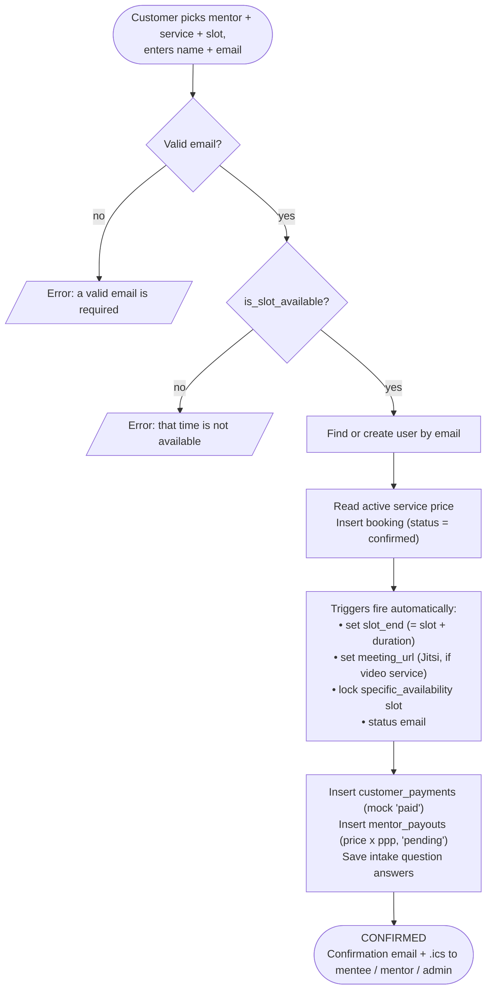
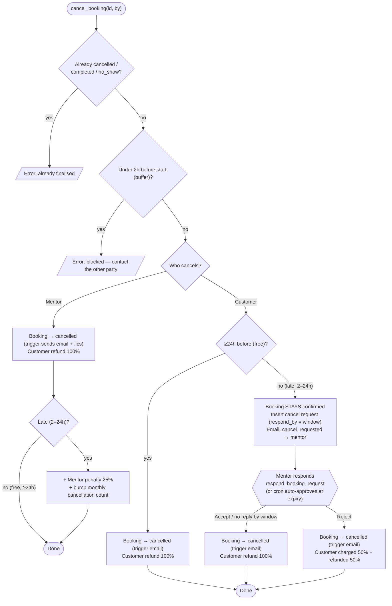
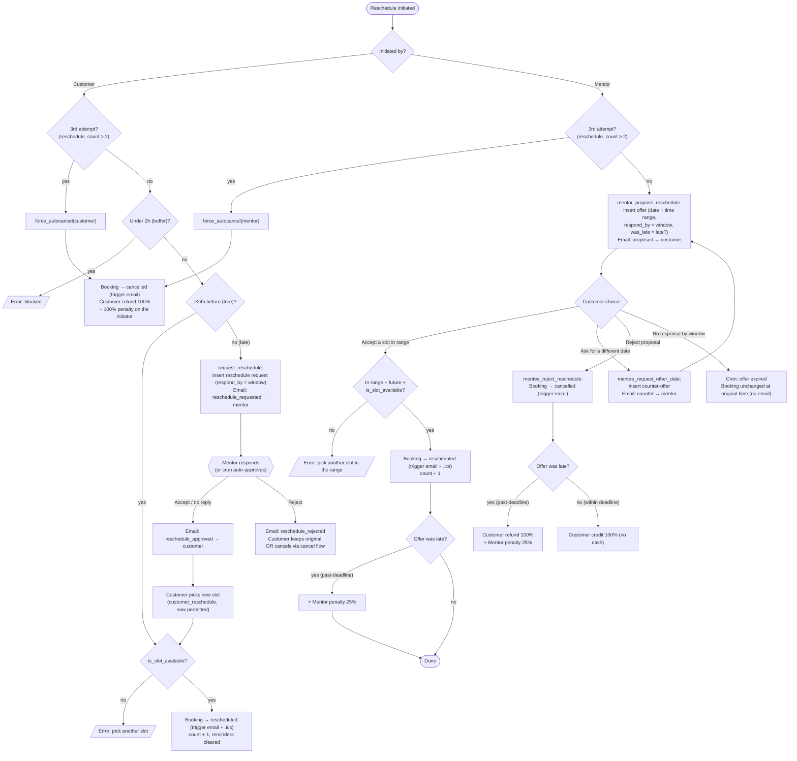
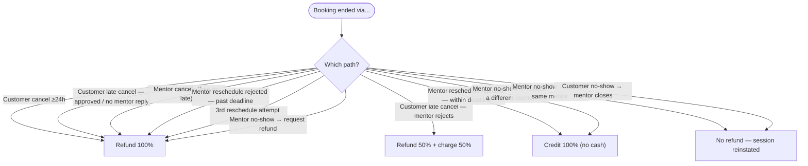
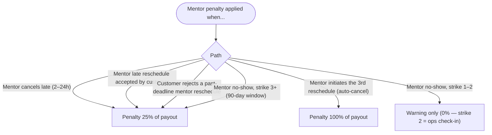

# Immigroov — Booking Flowcharts (as-built)

> These charts mirror the **live** functions documented in
> [`BOOKING_SYSTEM.md`](BOOKING_SYSTEM.md) (verified against the database on
> 2026-06-25). Every branch corresponds to a real code path; nothing here is
> aspirational. Each diagram lists the functions it covers underneath it.
>
> Deadline states come from `booking_deadline_state(slot)`:
> **≥24h before = free · 2–24h before = late · under 2h = buffer (blocked)**.
> The response/approval window is `response_window(slot) = MIN(now+48h, slot−2h)`.
>
> **Rendered SVGs** live in [`flowcharts/`](flowcharts/) (regenerate from the `.mmd`
> sources with `mmdc -i <name>.mmd -o <name>.svg -c flowcharts/theme.json`). Each section
> below shows the image plus its source.

---

## 1. Booking confirmation

**Covers:** `book_session_guest` → triggers `bookings_set_slot_end`, `set_meeting_url`,
`bookings_sync_slot_lock`, `trg_booking_status_email('confirmed')`. Booking is
**confirmed immediately on payment** — there is no separate mentor "accept" step.

---

## 2. Cancellation

**Covers:** `cancel_booking`, `respond_booking_request(kind='cancel')`,
`resolve_expired_requests` (auto-approve), `trg_booking_status_email('cancelled')`,
`bump_mentor_cancellation`. The cancelled email fires **once**, from the trigger
(fixed in migration `0048`).

---

## 3. Reschedule

**Covers:** `customer_reschedule`, `request_reschedule`,
`respond_booking_request(kind='reschedule')`, `mentor_propose_reschedule`,
`mentee_accept_reschedule`, `mentee_request_other_date`, `mentee_reject_reschedule`,
`force_autocancel`, `resolve_expired_requests` (auto-approve + offer expiry).

**Two real edge behaviours to note (from the code):**
- After a **late customer request is approved**, the customer must still call
  `customer_reschedule` to pick a slot. If they never do, the booking simply **runs at
  its original time** — approval only unlocks the pick.
- A **mentor offer that gets no response** is set to `expired` by the cron; the booking is
  **unchanged** and **no email** is sent on expiry.

---

## 4. Refund / credit / penalty outcomes

The money is mock — every outcome below is written as rows in `booking_ledger`
(`kind ∈ refund | credit | charge | penalty`, with a `pct`). Nothing is actually moved.

### What the customer gets

### What the mentor is charged (payout penalties)

### Full matrix (every terminal outcome)

| Path | Customer ledger | Mentor ledger | Booking status |
|---|---|---|---|
| Customer cancel ≥24h (free) | refund 100% | — | cancelled |
| Customer late cancel — approved / auto (no reply) | refund 100% | — | cancelled |
| Customer late cancel — rejected | charge 50% + refund 50% | — | cancelled |
| Mentor cancel ≥24h (free) | refund 100% | — | cancelled |
| Mentor cancel late (2–24h) | refund 100% | penalty 25% | cancelled |
| Mentor reschedule accepted (within deadline) | — | — | rescheduled |
| Mentor reschedule accepted (past deadline) | — | penalty 25% | rescheduled |
| Mentor reschedule rejected (within deadline) | credit 100% | — | cancelled |
| Mentor reschedule rejected (past deadline) | refund 100% | penalty 25% | cancelled |
| 3rd reschedule attempt — customer initiated | refund 100% + penalty 100% | — | cancelled |
| 3rd reschedule attempt — mentor initiated | refund 100% | penalty 100% | cancelled |
| Mentor no-show → rebook same | — | — | confirmed (reinstated) |
| Mentor no-show → rebook different | credit 100% | strike (3+ → penalty 25%) | no_show |
| Mentor no-show → refund | refund 100% | strike (3+ → penalty 25%) | no_show |
| Customer no-show → accept rebook | — | — | confirmed (reinstated) |
| Customer no-show → reject (close) | — | credit 100% (paid in full) | completed |

**Covers the ledger writes in:** `cancel_booking`, `respond_booking_request`,
`mentee_accept_reschedule`, `mentee_reject_reschedule`, `force_autocancel`,
`resolve_mentor_no_show`, `resolve_customer_no_show`, `apply_mentor_strike`
(all via `add_ledger`).

> No-show paths reach these outcomes only after a party manually reports via
> `flag_no_show(id, party)` (allowed only after **T+10 min**) — there is no automatic
> no-show detection in the current system.
